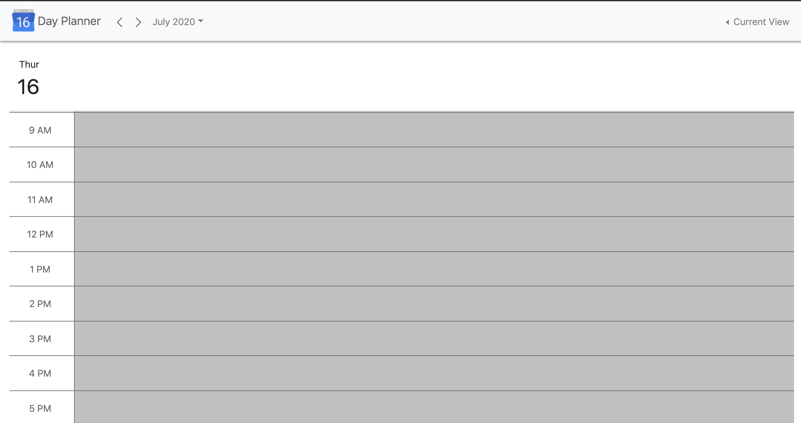
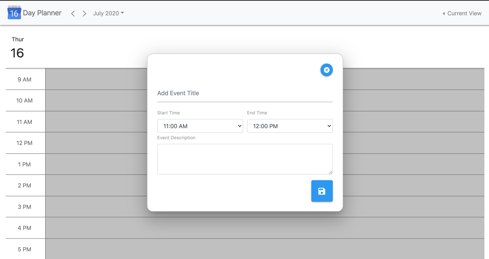
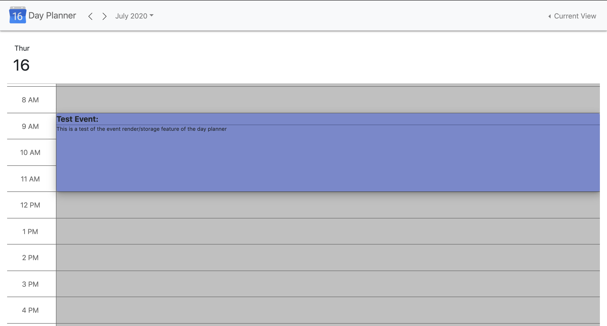

# 05 Third-Party APIs: Work Day Scheduler

This is a day planner created with Moment.js, jQuery, jQueryUI, Bootstrap, and MaterializeCSS.
https://logantwalker.github.io/HW-05-DayPlanner/

## Day View

When opening the planner, the current day is displayed along with the hours 9:00AM - 5:00PM. You can also scroll to see the rest of the available hours in the day.

Time blocks that are in the past are colored gray. Time blocks in the future are white. The present time block has a blue border.

## Entering an event

When a time block is clicked, the event input form is displayed.

## Rendering/Storing Events

When the save button is pressed, the event is rendered on the page and stored in local storage. You can create events up to 8hrs in length. Additionally, due to time constraints, you can only enter a combined total of 8hrs worth of events before they start getting out of place. To get the best result rendering an event on the page, please have the chrome inspector closed and please don't try to overlap events. Setting screen size to 1280x800 will show you exactly what I see.

## Future Work

In the future, I would like to work out the kinks with placing the event blocks on the page. I also would like to implement a month view and week view to allow the user to plan out events in advance. However, I think i bit off more than I could chew with the time available to me.
